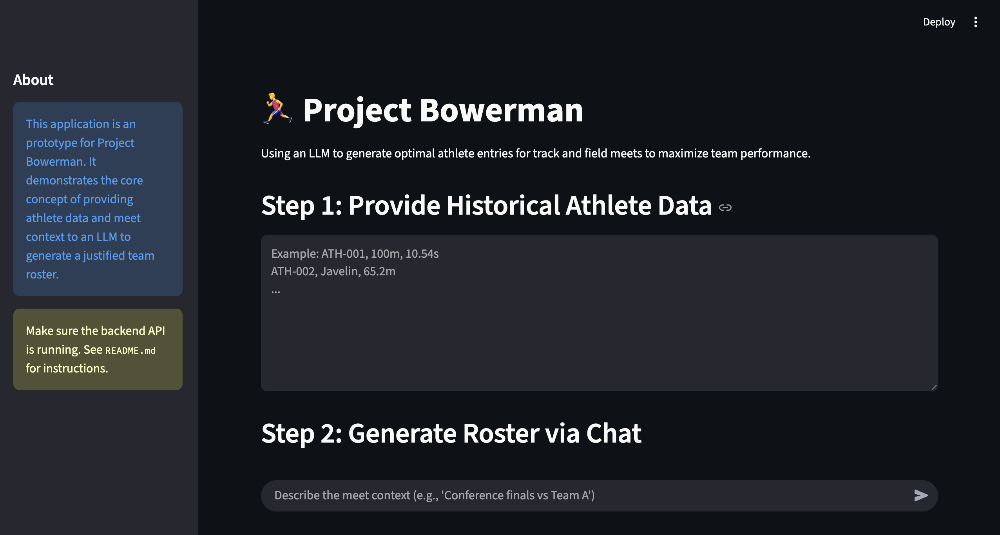
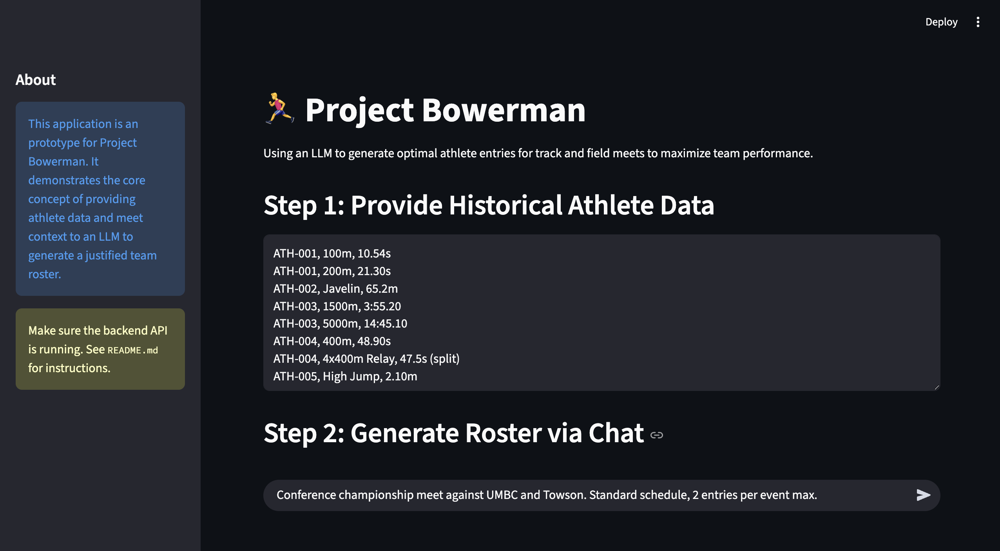
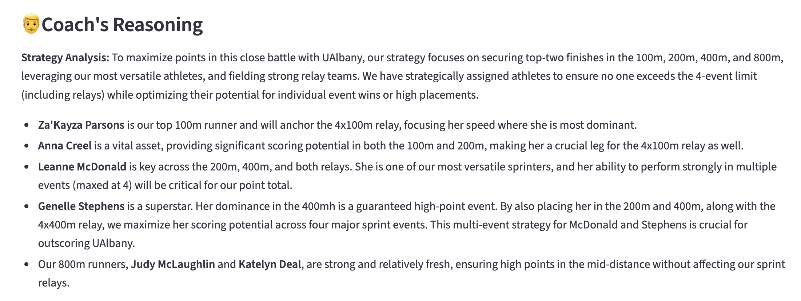
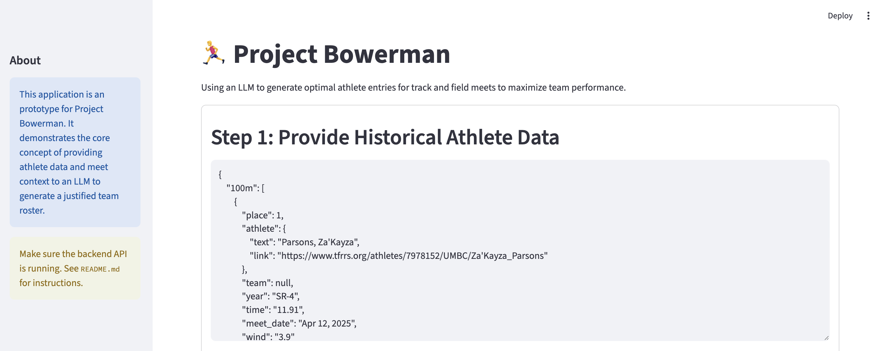

# Project Bowerman: Streamlit + FastAPI MVP
# 🏃‍♂️ Project Bowerman: Optimal Athlete Entry Predictor
This project explores the reasoning capabilities of large language models to generate strategies for assigning athletes to track events to maximize team performance. It investigates whether language models can perform the required reasoning tasks, such as planning and optimization, using natural language and historic information as input.

This project is split into two parts:
- frontend/app.py: The Streamlit frontend.
- backend/api.py: The FastAPI backend (which contains the placeholder LLM logic).

You must run both services simultaneously in separate terminal windows for the application to work.

## 1. Installation
This project uses uv for dependency management, as defined in pyproject.toml.
First, ensure you have uv installed. If not, you can install it with:

``pip install uv``

Then, sync the project dependencies:

``uv sync``

## 2. Run the Backend (API)
Open your first terminal window and run the FastAPI server using uv run:

``uv run uvicorn backend.api:app --reload``

- api: This tells uvicorn to look for the ``api.py`` file inside the backend directory (as a Python module).
- app: This refers to the app = FastAPI() object inside ``backend/api.py``.
- --reload: This makes the server automatically restart if you make changes to ``backend/api.py``.

You should see output indicating the server is running, typically at http://127.0.0.1:8000.

## 3. Run the Frontend (Streamlit)
Open a second terminal window. Run the Streamlit app using uv run:

``uv run streamlit run frontend/app.py``

This will automatically open the Streamlit application in your web browser.

## 4. How to Use
- With both services running, open the Streamlit app in your browser.
- Paste your historical athlete data into the "Step 1" text area.
- Type your meet context (e.g., "Conference finals vs Team A") into the chat input at the bottom of the page and press Enter.
- The Streamlit app will send this data to your local FastAPI backend, wait for the response, and then display the results.

## 5. Screenshots
# Data input
Input data is gratiously provided UMBC_f_performances.json.

# Example context input

# Reasoning output example

# Roster output example
